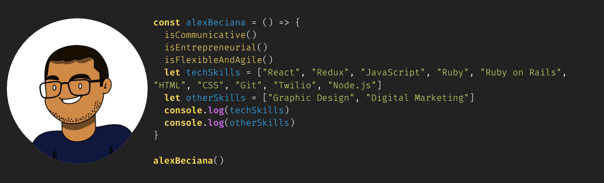

 <h1 align="center">👋 Hey, I'm Alex</h1>

<!--  -->

<h3 align="center">Full-stack web developer with an entrepreneurial spirit with experience in digital marketing and leading a startup.</h3>

<h3 align="center">CEO, Founder of <a href="https://www.sweetstatic.com">Sweet Static</a> and Creator of <a href="https://rubygems.org/gems/rcli_app">rcli_app</a></h3>
<h3>Dev Jokes</h3>

    <li>🔭 I’m currently working on <strong>Jobase</strong></li>
    <li>🌱 I’m currently learning <strong>NextJS</strong></li>
    <li>👯 I’m looking to collaborate on <strong>open-source projects</strong></li>
    <li>🤔 I’m looking for help with <strong>career mentorship</strong> and <strong>side-project partners</strong></li>
    <li>📫 How to reach me: <a href="mailto:alex.beciana@gmail.com">alex.beciana@gmail.com</a></li>
    <li>🏃 Keep up with me on my <a href="https://alexbeciana.com/" target="_blank" alt="Alex Beciana - Portfolio">portfolio</a></li>
    <li>🏋 <a href="https://www.alexbeciana.com/about" target="_blank" alt="Alex Beciana - Skills, Experience, and Education">Learn more</a> about professional skills, experience, and education </li>
    <li>😄 Pronouns: He/Him</li>
    <li>🎨 Hobbies: Hiking, creating Bauhaus designs, reading, playing music, analyzing films</li>

 
 
<!-- - ⚡ Fun fact: ... -->
<!-- - 💬 Ask me about ... -->

<!-- 
<h4>📝 Blog Posts</h4>
 -->
 

 
 
 
 
 
 
 
 
  
 
 
 
 
 
  
 
 
 

<h3>Projects In Progress</h3>

    <h4>Jobase</h4>
    A job seeker's best friend. An all-in-one job-seeking tool to find jobs, create a professional profile, and so much more.
     
     
    

        
        
    

 
 
<h3>Completed Projects</h3>

    <h4>Le Cine</h4>
    A film club management app to bring meaningful conversation and film lovers together under one roof.
     
     
    

        
        
    

 <!-- 
&nbsp;
 -->
 
 

 <!-- 
 -->
<!-- 
 -->

<!--  -->
