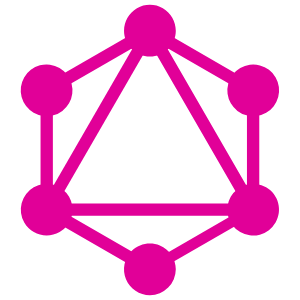
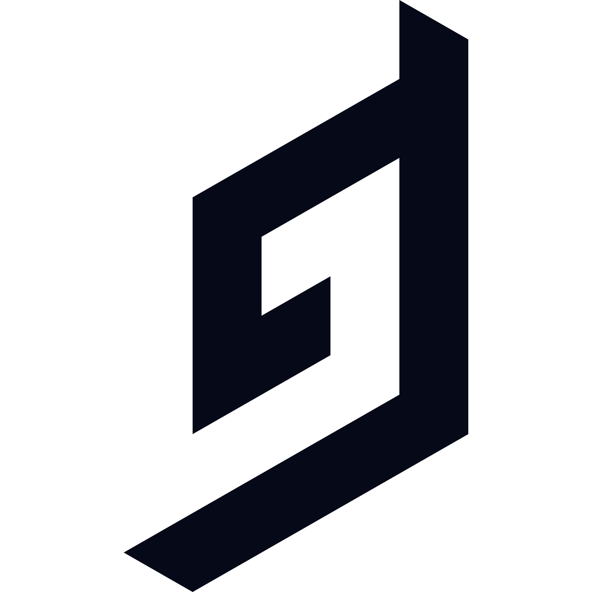
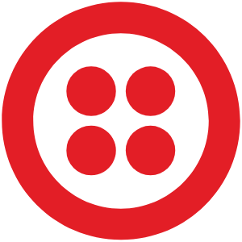
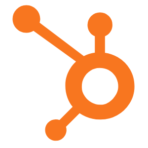
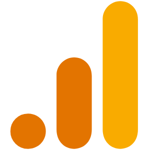

 <h1 align="center">👋 Hey, I'm Alex</h1>

Jump to a section

<a href="#about-me">About Me</a>
|
<a href="#dev-jokes">Dev Jokes</a>
|
<a href="#skills">My Skills</a>
|
<a href="#projects">My Projects</a>

<!--  -->

Full-stack software engineer with an studious spirit with experience in digital marketing and leading a startup.

<h2>Dev Dad Jokes</h2>

<h2>A little more about me...</h2>

Full-stack software engineer with 3 years of experience with a studious spirit. I also have 5 years of digital marketing, product management, and community management experience, working in tech (startup to FAANG), education, and music as well as leading a profitable startup. I'm accustomed to the Agile methodology, working across technical and non-technical teams, and managing project roadmaps.

 
 
<ul style="font-size: 1.2rem; list-style-type: none;">
    <li>🔭 I’m thinking about my next project.</li>
    <li>🌱 I’m brushing up on my <strong>Data Structures and Algorithms</strong></li>
    <li>👯 I’m looking to collaborate on <strong>open-source projects</strong></li>
    <li>📫 How to reach me: <a href="mailto:alexander.beciana@gmail.com">alexander.beciana@gmail.com</a></li>
    <li>🏃 Keep up with me on my <a href="https://alexbeciana.com/" target="_blank" alt="Alex Beciana - Portfolio">portfolio</a></li>
    <li>🏋 <a href="https://alexbeciana.com/about" target="_blank" alt="Alex Beciana - Skills, Experience, and Education">Learn more</a> about professional skills, experience, and education </li>
    <li>😄 Pronouns: He/Him</li>
    <li>🎨 Hobbies: Hiking, creating Bauhaus designs, reading, playing music, analyzing films</li>
    <li>💬 Ask me about how I got into engineering</li>
</ul>
 

 
 <h2>My Skills</h2>
 

 
 
 
 
 
 
 
 
 
 
 
 
  
  
 
 
 
 
 
 
  
 
 
 
 
 
 
 
 
 
 

<!--  -->
 

 
 

<h2>Recent Projects</h2>
 

    <h3>Drop The Needle</h3>
    A power hour management app for participants and hosts. This project was created as a more intuitive alternative to MyTube60.
     
     
    

    
    

 <!-- 
&nbsp;
 -->
 
 

<!--  -->
